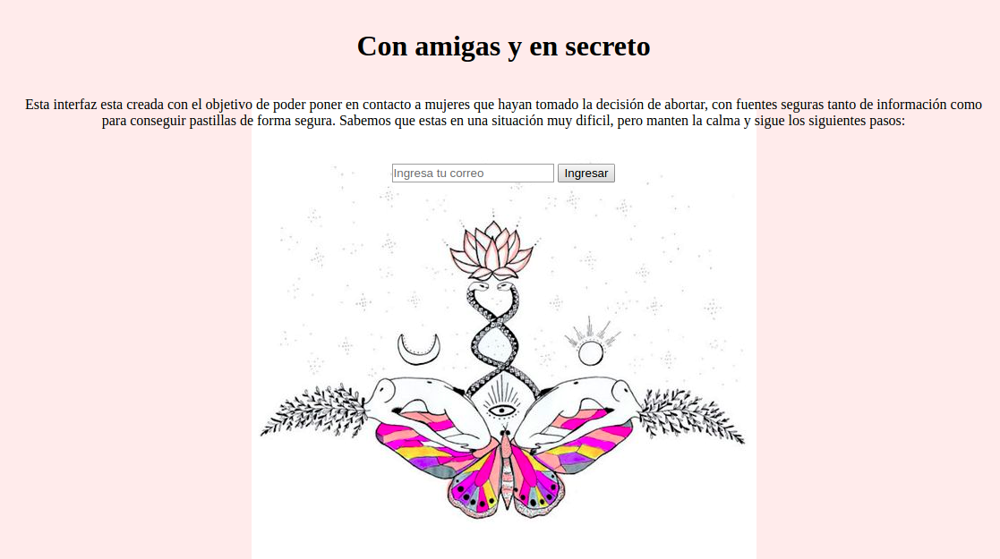

# CON AMIGAS Y EN SECRETO

## OBJETIVO DEL PRODUCTO:
El objetivo del producto es proporcionar una comunicación secreta entre mujeres que esten en situación de borto con fuentes seguras de información y ayuda.

## USUARIOS:
Las personas para que esta diriga el producto, son mujeres que esten en situación de aborto.

## METODO UTILIZADO: 
CIFRADO CESAR
________________________
Es un tipo de cifrado por sustitución en el que una letra en el texto original es reemplazada por otra letra que se encuentra un número fijo de posiciones más adelante en el alfabeto.

### Definición del producto:

Este producto fue diseñado para mujeres que hayan tomado la decisión de abortar y esten en busca tanto de información acerca del tema en cuestión como también, el contacto para conseguir pastillas abortivas. Con foco en esta necesidad y en un contexto de ilegalidad, esta interfaz entrega una solución para la comunicación secreta y segura entre mujeres en situación de aborto y las fuentes de información y ayuda necesaria.

### Modo de Uso:
Esta interfaz funciona de la siguiente forma, en la primera pantalla se describe para quien esta dirigido el producto, luego un recuadro para ingresar el email de la persona que requiera comunicarse, luego de introducir el email, se selecciona el boton de "ingresar" que abrirá una nueva pantalla donde la persona ingresará su mensaje comentando que tipo de ayuda necesita; luego se introducirá el numero de desplazamiento que indica cuantos espacios se recorrera en el alfabeto para sustituir una letra por otra, luego se seleccionara el boton de "cifrar" que convertira el mensaje y finalmente se hace click en el boton de "enviar" que envia el mensaje cifrado a fuentes seguras de contacto que luego devolveran un mensaje cifrado al email, pedido en el primer paso. El mensaje llegará con un número especificado en el asunto que será el numero de desplazamiento para descifrar el mensaje. Se utiliza la misma interfaz para descifrar el mensaje. 

### Planificación:
https://trello.com/b/9IvN90XE/cesar

### Anexos: Imágenes 

### GitHub
https://github.com/Msaezcardenas/scl-2018-11-bc-core-cipher
https://msaezcardenas.github.io/scl-2018-11-bc-core-cipher/

